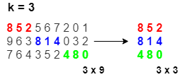

### Question 1 - Large

Write a program that reads an integer N from the user, then reads N more integers from the user and store them in an array. Then prints elements larger than the average of numbers held in the array.

| Input                         | Output     |
| ----------------------------- | ---------- |
| 10  1 2 3 4 5 6 7 8 9 10 | 6 7 8 9 10 |
| 4  4 1 3 8               | 8          |

### Question 2 - Encryption

Write a program which reads a sentence from the user (read characters until '\n' appears). Your program then should put this sentence into a char array (assume the sentence will be shorter than 50 characters).

Then, encrypt this sentence by adding +1 to the value of each character and print the encrypted version of the char array to the screen.

Then, decrypt this sentence by adding -1 to each character, and print the decrypted version of the char array to the screen.

| Input          | Output                              |
| -------------- | ----------------------------------- |
| Hello Bogazici | Ifmmp!Cphb{jdj� Hello Bogazici |
| Stay at home   | Tubz!bu!ipnf�  Stay at home    |

### Question 3 - Reverse

Write a program which reads an integer N from the user, then reads N integers from the user and store them in an array (Assume N is smaller than 50).

**a**. Then print them to the screen in reverse order.

**b.** Then reverse the order of these integers in the array and print the array.

| Input                  | Output         |
| ---------------------- | -------------- |
| 5  3 1 -4 5 2     | 2 5 -4 1 3     |
| 6  15 7 2 89 8 12 | 12 8 89 2 7 15 |

### Question 4 - Let's Count

Write a program which reads an integer N from the user, then reads N integers from the user to an array. Then find frequency of each element in the array. Assume N is smaller than 1000 and the entered numbers will be between 0 and 100 (inclusive).

| INPUT                           | OUTPUT                                                       |
| ------------------------------- | ------------------------------------------------------------ |
| 10  5 10 2 5 50 5 10 1 2 2 | 1 --> 1  2 --> 3  5 --> 3  10 --> 2  50 --> 1 |

### Question 5 - Inception 

Write a program which reads two integers: N and M from the user. Then the program should read N more integers, then M more integers from the user. Assume N < M < 50.

If the first combination of N integers appears at least once in the second combination of M integers, the program should write the starting index of the first appearance in the second combination. Otherwise it should not print anything.

| Input                                              | Output |
| -------------------------------------------------- | ------ |
| 4 12  4 5 6 5  1 2 1 2 99 99 4 5 6 5 9 9 | 6      |
| 3 5  2 2 2  1 2 2 2 2 5                  | 1      |
| 3 5  2 3 2  1 2 2 2 5                    |        |

### Question 6 - Pairs

Write a program which reads an integer N and an integer X from the user, then reads N integers from the user to an array. Then find all pairs in the array whose sum is equal to X.

- A number can not be a pair with itself. Pairs should consist of different numbers.
- You can print either (3,4) or (4,3) for one pair.
- You should print all the pairs even if they are same.

| INPUT                     | OUTPUT                                        |
| ------------------------- | --------------------------------------------- |
| 7 7 2 4 3 5 7 8 9         | (2, 5)  (4, 3)                           |
| 10 7 2 4 3 5 6 -2 4 7 8 9 | (2, 5)  (4, 3) (3, 4)  (-2, 9) |

### Question 7 - fix34

Write a program which reads an integer N from the user, then reads N integers from the user to an array. Then rearrange the array so that every 3 is immediately followed by a 4. Do not move the 3's, but every other number may move. The array contains the same number of 3's and 4's, every 3 has number after it that is not a 3, and a 3 appears in the array before any 4.

| INPUT                 | OUTPUT        |
| --------------------- | ------------- |
| 4  1 3 1 4       | 1 3 4 1       |
| 7  1 3 1 4 4 3 1 | 1 3 4 1 1 3 4 |
| 4  3 2 2 4       | 3 4 2 2       |

### Question 8 - Bubble Sort

Write a program which reads an integer N from the user, then reads N integers from the user to an array. Then sort elements of the array in ascending order.

| INPUT             | OUTPUT          |
| ----------------- | --------------- |
| 8 4 2 8 6 7 3 1 5 | 1 2 3 4 5 6 7 8 |

Bubble Sort is the simplest sorting algorithm that works by repeatedly swapping the adjacent elements if they are in wrong order.

Example:

First Pass:

- ( **5** **1** 4 2 8 ) –> ( **1** **5** 4 2 8 ), Here, algorithm compares the first two elements, and swaps since 5 > 1.
- ( 1 **5** **4** 2 8 ) –> ( 1 **4** **5** 2 8 ), Swap since 5 > 4
- ( 1 4 **5** **2** 8 ) –> ( 1 4 **2** **5** 8 ), Swap since 5 > 2
- ( 1 4 2 **5** **8** ) –> ( 1 4 2 **5** **8** ), Now, since these elements are already in order (8 > 5), algorithm does not swap them.

Second Pass:

- ( **1** **4** 2 5 8 ) –> ( **1** **4** 2 5 8 )
- ( 1 **4** **2** 5 8 ) –> ( 1 **2** **4** 5 8 ), Swap since 4 > 2
- ( 1 2 **4** **5** 8 ) –> ( 1 2 **4** **5** 8 )
- ( 1 2 4 **5** **8** ) –> ( 1 2 4 **5** **8** )

Now, the array is already sorted, but our algorithm does not know if it is completed. The algorithm needs one whole pass without any swap to know it is sorted.

Third Pass:

- ( **1** **2** 4 5 8 ) –> ( **1** **2** 4 5 8 )
- ( 1 **2** **4** 5 8 ) –> ( 1 **2** **4** 5 8 )
- ( 1 2 **4** **5** 8 ) –> ( 1 2 **4** **5** 8 )
- ( 1 2 4 **5** **8** ) –> ( 1 2 4 **5** **8** )

## Multidimensional Arrays

### Question 1 - Transpose of a Matrix

Write a program which reads two integers N, M, and a 2-dimensional array with size NxM from the user and prints its transpose.

| INPUT                       | OUTPUT                  |
| --------------------------- | ----------------------- |
| 2 3  5 2 4  1 4 0 | 5 1  2 4  4 0 |

### Question 2 - 2D Arrays with Functions

Write a function named **print_2d_array()** which takes the sizes of a 2-dimensional array and an array as parameters and prints it.

Write a function named **read_2d_array()** which takes the sizes of a 2-dimensional array and an array as parameters and reads its content from the user.

### Question 3 - Matrix Addition

Write a program that reads two integers N and M, and then reads two 2-dimensional integer arrays with the size NxM from the user. The program then performs the matrix addition on these two 2d arrays and prints the result.

| INPUT                                                        | OUTPUT                |
| ------------------------------------------------------------ | --------------------- |
| 2 4   1 1 1 2  1 2 3 4   6 6 6 5  6 5 4 3 | 7 7 7 7  7 7 7 7 |

### Question 4 - Diagonal Sum

Write a program to find sum of left and right diagonals of a 2-dimensional array. The program should first read an integer N and then a 2d integer array of size NxN from the user.

| INPUT                                   | OUTPUT                                                       |
| --------------------------------------- | ------------------------------------------------------------ |
| 3  1 6 10  5 2 3  6 80 6 | The sum of the left diagonal: 9  The sum of the right diagonal: 18 |

## Question 5 - Row Sum

Write a program reads a 2D array and an integer k. Print this array following the pattern below:

For the first row, print first k elements and sum of them. For the second row, print first 2k elements and sum of them. For the third row, print first 3k elements and sum of them.

Apply this for all rows. If x_k becomes higher then the row size, print and sum all elements in the row.

| INPUT                                                        | OUTPUT                                                       |
| ------------------------------------------------------------ | ------------------------------------------------------------ |
| 3 11 3 8 5 2 5 6 7 2 0 1 4 7 9 6 3 8 1 4 0 3 2 7 5 7 6 4 3 5 2 4 8 0 9 4 | 8 5 2 15 9 6 3 8 1 4 31 7 6 4 3 5 2 4 8 0 39         |
| 4 7 3 1 2 3 4 5 6 7 1 2 3 4 5 6 7 1 2 3 4 5 6 7 1 2 3 4 5 6 7 | 1 2 3 6 1 2 3 4 5 6 21 1 2 3 4 5 6 7 28 1 2 3 4 5 6 7 28 |

## Question 6 - Slice

Write a program reads a N X M array and an integer k. Then, creates a N X k array and fills it as follows and prints it: 

Assume k divides M without remainder. 

| INPUT                                                        | OUTPUT                      |
| ------------------------------------------------------------ | --------------------------- |
| 3 9 3 8 5 2 5 6 7 2 0 1 9 6 3 8 1 4 0 3 2 7 6 4 3 5 2 4 8 0 | 8 5 2 8 1 4 4 8 0   |
| 4 8 2 1 2 3 4 5 6 7 8 1 2 3 4 5 6 7 8 1 2 3 4 5 6 7 8 1 2 3 4 5 6 7 8 | 1 2 3 4 5 6 7 8 |